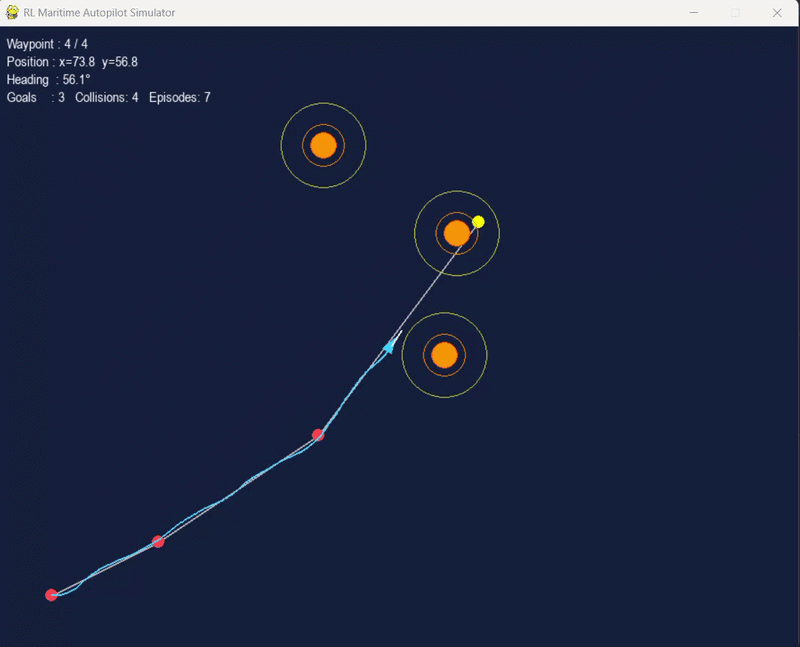

# RL Maritime Autopilot 🚢

A reinforcement learning system that trains an autonomous ship to navigate through multiple waypoints while avoiding **dynamic obstacles and ocean currents**.

The agent is trained using **Proximal Policy Optimization (PPO)** and learns robust navigation behaviour in a custom **Gymnasium environment** with realistic ship dynamics.


---

# Demo

The trained agent navigates from **(10,10) → (90,80)** through **4 waypoints** on a **100×100 maritime map**, avoiding moving obstacles and ocean currents in real time.




### Performance

| Metric              | Result                 |
| ------------------- | ---------------------- |
| Goal rate           | **80%** (100 episodes) |
| Collision rate      | **20%**                |
| Collisions per goal | 0.25                   |
| Training steps      | **6M + 2M fine-tune**  |

---

# Project Overview

Autonomous maritime navigation is challenging because the agent must simultaneously:

* follow a planned route
* avoid dynamic obstacles
* compensate for environmental disturbances
* maintain stable ship dynamics

This project builds a **fully custom reinforcement learning pipeline** including:

* Ship physics model
* Ocean current simulation
* Dynamic obstacle field
* Waypoint navigation system
* PPO training pipeline
* Real-time simulator
* Evaluation metrics and report generation

---

# Project Structure

```
RL-Maritime-Path-Following-Autopilot/
│
├── env/
│   └── maritime_env.py          # Gymnasium environment (18-feature obs space)
│
├── dynamics/
│   ├── ship_model.py            # Ship physics (speed, yaw, heading)
│   ├── ocean_current.py         # Spatial flow field + turbulence
│   └── obstacle_field.py        # Dynamic obstacles with velocity
│
├── navigation/
│   ├── waypoint_manager.py      # Waypoint sequencing
│   └── path_utils.py            # Cross-track error + pure pursuit
│
├── training/
│   └── train_ppo.py             # Curriculum PPO training
│
├── visualization/
│   ├── simulator.py             # Pygame simulator
│   └── plot_metrics.py          # Metrics plots + PDF report
│
├── models/
│   ├── maritime_autopilot.zip
│   ├── env_normalization.pkl
│   └── best/
│       └── best_model.zip
│
├── metrics/
│   ├── episode_log.json
│   └── *.png / maritime_report.pdf
│
└── README.md
```

---

# Installation

### Requirements

* Python 3.11
* pip

### Setup

```bash
git clone https://github.com/yourname/RL-Maritime-Path-Following-Autopilot.git
cd RL-Maritime-Path-Following-Autopilot

python -m venv venv
venv\Scripts\activate        # Windows
source venv/bin/activate     # Linux / Mac

pip install stable-baselines3[extra] gymnasium pygame matplotlib numpy
```

---

# Quick Start

## Run the Simulator

```bash
python visualization/simulator.py
```

The simulator loads the trained model and continuously runs navigation episodes.

### HUD Displays

* Current waypoint progress
* Ship position and heading
* Episode statistics
* Running success metrics

### Obstacle Visualization

| Indicator    | Meaning            |
| ------------ | ------------------ |
| Yellow ring  | Warning zone       |
| Orange ring  | Danger zone        |
| Solid orange | Collision boundary |

---

# Metrics and Evaluation

After running episodes, generate performance plots:

```bash
python visualization/plot_metrics.py
```

This produces plots inside **metrics/**:

| Plot                | Description                 |
| ------------------- | --------------------------- |
| reward plot         | episode reward progression  |
| goal/collision rate | rolling success vs failures |
| episode length      | survival time               |
| reward components   | reward breakdown            |
| policy comparison   | early vs late performance   |

A full evaluation report is also generated:

```
metrics/maritime_report.pdf
```

---

# Training

### Full Training

```bash
python training/train_ppo.py
```

### Curriculum Training

| Phase   | Obstacles | Steps | Purpose                      |
| ------- | --------- | ----- | ---------------------------- |
| Phase 1 | 2         | 4M    | Learn stable path following  |
| Phase 2 | 3         | 2M    | Fine-tune obstacle avoidance |

Total training time: **~4 hours CPU**

---

# Environment

## Observation Space (18 features)

Includes:

* ship position and heading
* waypoint direction
* cross-track error
* ocean current vector
* obstacle distances
* obstacle relative velocities

This gives the agent full situational awareness.

---

## Action Space

| Action   | Range  | Description   |
| -------- | ------ | ------------- |
| rudder   | [-1,1] | steering      |
| throttle | [0,1]  | speed control |

---

# Reward Function

The reward balances **navigation efficiency and safety**.

| Component        | Description             |
| ---------------- | ----------------------- |
| Progress reward  | movement along path     |
| Heading reward   | alignment with waypoint |
| CTE penalty      | cross-track error       |
| Obstacle penalty | proximity penalty       |
| Waypoint bonus   | waypoint reached        |
| Goal bonus       | mission completed       |

---

# PPO Configuration

| Parameter     | Value               |
| ------------- | ------------------- |
| Learning rate | 3e-4 → 1e-4         |
| Batch size    | 512                 |
| n_steps       | 2048                |
| gamma         | 0.99                |
| gae_lambda    | 0.95                |
| Network       | `[256,256,128]` MLP |
| Parallel envs | 4                   |

---

# Results

### Training Progress

| Stage                    | Goal Rate | Collision Rate |
| ------------------------ | --------- | -------------- |
| Initial training         | ~5%       | 60%+           |
| Normalization fixes      | 64%       | 34%            |
| Observation improvements | 71%       | 28%            |
| Final fine-tune          | **80%**   | **20%**        |

---

# Key Engineering Fixes

Major improvements during development:

1. Removed **double observation normalization**
2. Fixed simulator coordinate inversion
3. Corrected waypoint initialization bug
4. Fixed progress reward reset at segment transitions
5. Added obstacle direction + velocity features
6. Reduced excessive collision penalty

These fixes significantly improved training stability.

---

# Dependencies

```
stable-baselines3[extra]
gymnasium
pygame
numpy
matplotlib
```

---

# License

MIT License
